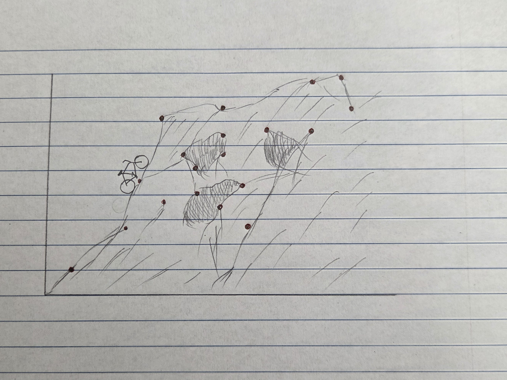
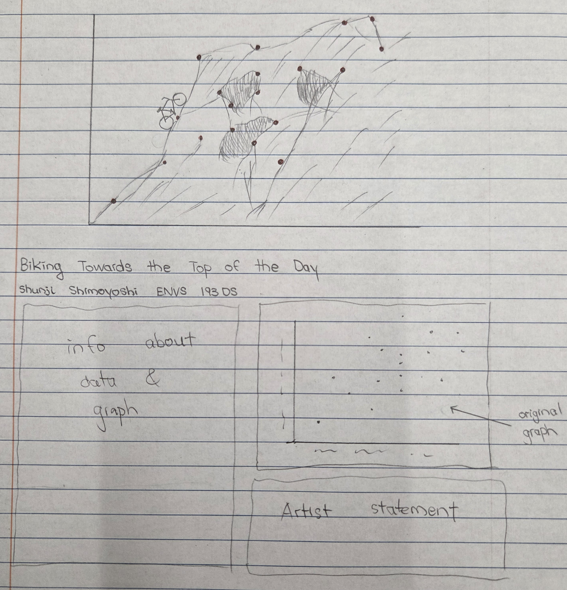

# Homework Setup

```{r}
#| label: reading in packages and data

# reading in packages
library(tidyverse)
library(here)
library(janitor)
library(readxl)
# creating new object from data set
kelp <- read_csv(here("data","temp-kelp.csv"))
bike <- read_csv(here("data","ENVS-193DS-Personal-Data-Project-cont.csv"))

```

# Problem 1. Giant kelp fronds

## a. An appropriate test

The two tests that are appropriate to describe the strength of the relationship between temperature and giant kelp frond elongation rate are a linear model and a correlation test. A linear model will tell us how well temperature can be used to predict kelp frond elongation rate, while correlation can tell us whether these two variables are related to each other. Given that we do not have a specific hypothesis on how temperature affects kelp frond elongation rate, both tests should be used to accurately describe the relationship. 

## b. Create a visualization

```{r}
#| label: visualizing data

# base layer: ggplot
ggplot(data = kelp, # data frame: kelp
       # x-axis: temperature
       # y-axis: kelp frond elongation rate
       mapping = aes(x = temp_c,
                     y = kelp_elong)) +
  # first layer: points to represent individual observations
  geom_point(color = "blue") + # using custom colors
  # relabeling axes, adding title
  labs(x = "Temperature (°C)", 
       y = expression("Kelp frond elongation rate(cm day"^-1~")")) +
  # changing theme
  theme_light()

```

## c. Check your assumptions and run your test

### Checking assumptions

```{r}
#| label: kelp qq plot

# base layer: ggplot
ggplot(data = kelp, # data frame: kelp
       # y-axis for QQ plot (no x-axis for QQ plot)
       aes(sample = kelp_elong)) + 
  # first layer: QQ reference line
  geom_qq_line(color = "blue") +
  # second layer: QQ plot
  geom_qq() +
  # custom theme
  theme_light()

```

Based on the initial visualization, we can expect a linear relationship between temperature and kelp frond elongation rate. Both temperature and kelp frond elongation rate are continuous variables. Both variables are normally distributed, based on points roughly following the reference line on the QQ plot. Finally, observations are assumed to be independent.

### Running test

```{r}
#| label: correlation test for kelp model

cor.test(kelp$kelp_elong, kelp$temp_c, # variables: kelp elongation rate and temperature
         method = "pearson") # method: pearson's correlation (r)

```

## d. Results communication

To evaluate the strength of the relationship between temperature and giant kelp frond elongation rate, we used a Pearson's correlation (r) test. A correlation test was appropriate for this as we wanted to determine the strength of the relationship between these two variables. 

We found a moderate negative relationship between ocean temperature and giant kelp frond elongation rate (Pearson's r = -0.69, t(30) = -5.12, p < 0.001, $\alpha$ = 0.05).

## e. Test implications

From this study, we found that as ocean temperature increases, giant kelp frond elongation rate decreases. We found a moderate negative relationship between ocean temperature and giant kelp frond elongation rate (Pearson's r = -0.69, t(30) = -5.12, p < 0.001, $\alpha$ = 0.05).

## f. Double check your work

### Fitting linear model

```{r}
#| label: kelp linear model

kelp_model <- lm(
  kelp_elong ~ temp_c, # formula: kelp elongation rate as a function of temperature
  data = kelp # data frame: kelp
)

```

### Diagnostics

```{r}
#| label: checking assumptions of kelp model

# display plots in a 2x2 grid
par(mfrow = c(2, 2))
# display diagnostic plots
plot(kelp_model)

```

- Residuals vs Fitted and Scale-Location: checking homoscedasticity of residuals, residuals seem to have constant variance based on even distribution around the horizontal red line

- Q-Q Residuals: checking distribution of residuals, residual is normally distributed based on points following the dotted line relatively closely

- Residuals vs Leverage: checking for outliers, no outliers outside dotted lines that would influence model predictions

### Model Summary

```{r}
#| label: summary of kelp model

# displaying result of kelp linear model
summary(kelp_model)

```

**For each 1°C of ocean temperature increase, we would expect a giant kelp frond elongation rate decrease of 0.43 ± 0.08 (SE) cm/day.**

This result from the linear model would have led me to make the same decision about the null hypothesis. As ocean temperature increases, giant kelp frond elongation rate decreases. The only difference is that the strength of this relationship would have not been known without the correlation test.

# Problem 2. Personal Data

## a. Updating your visualizations

```{r}
#| label: visualizing personal data project

# base layer: ggplot
ggplot(data = bike, # data frame: bike
       # x-axis: weather
       # y-axis: Duration of bike ride
       # coloring by weather
       aes(x = Weather,
           y = `Duration of bike ride (minutes)`,
       color = Weather)) +
  # first layer: boxplot
  geom_boxplot() +
 # relabeling the axes, adding title and subtitle
  labs(x = "Wind Condition", 
       y = "Duration of bike ride (minutes)",
       title = "Biking in windy conditions increases the time spend biking",
       subtitle = "Most recent observation: 5/23/2026") +
 # custom theme
  theme_light() +
  # removing legend
  theme(legend.position = "none") + 
  # changing the color
  scale_color_manual(values = c("calm" = "blue",
                                "windy" = "red"))

```

```{r}
#| label: visualizing personal data project 2

# base layer: ggplot
ggplot(data = bike, # data frame: bike
       # x-axis: duration of day's activities
       # y-axis: Duration of bike ride
       aes(x = `Duration of day's activities (hours)`,
           y = `Duration of bike ride (minutes)`,)) +
  # first layer: points
  geom_point(color = "firebrick") +
 # relabeling the axes, adding title and subtitle
  labs(x = "Duration of day's activities (hours)", 
       y = "Duration of bike ride (minutes)",
       title = "Daily Duration of Activities Effect on Time Spent Biking",
       subtitle = "Most recent observation: 5/23/2026") +
 # custom theme
  theme_light() +
  # removing legend
  theme(legend.position = "none")

```

## b. Captions

**Figure 1. Biking in windy conditions increases the time spend biking** Difference in time spent biking between calm and windy conditions is shown as a boxplot. Median, IQR, errorbars, and outliers are visualized and wind condition type is differentiated based on color. Wind data citation: Weather Underground SBFD Station 1 - KCASANTA4905

**Figure 2. Daily Duration of Activities Effect on Time Spent Biking** As duration of day's activities increases, time spent biking also increases. Individual daily observations are shown as dots on the graph.

# Problem 3. Affective visualization

## a. Describe in words what an affective visualization could look like for your personal data.

I think an interesting affective visualization for my personal data could be a sort of bike race to a top of a mountain. This would be for my scatterplot, where duration of daily total bike rides is visualized as a function of the duration of day's activities. Each point could represent a ridge line or outcropping and the slope of the mountain would roughly follow the data points upward. Given that this is graph about my bike riding tendencies, I think this would be a creative and interesting way to represent that.

## b. Create a sketch of your idea


  
## c. Make a draft of your visualization



## d. Write an artist statement

This piece is a visualization of my biking habits in spring quarter. While trying to ignore my packed schedule, I was thinking and became interested in seeing whether or not this had an effect on the amount of bike travel I did in a day to get where I need to be. I was inspired by Jill Pelto's techniques for this piece, as I thought her blending of art and data representation was interesting and beautiful. This digital art drawing depicts the individual data points as the rocky, chaparral-covered slopes of the Santa Ynez Mountains right above UCSB's campus. I collected the data over the course of around a month, while the digital drawing was done on Photoshop.

## e. Prep your materials to share in class


# Problem 4. Statistical critique

## a. Revisit and summarize

The authors tested the hypothesis that California abalone species are negatively affected by warming ocean temperatures. 
- Test used: ANOVA (Analysis of Variance)
- Response Variable(s): Abalone growth, reproductive output, disease, mortality
- Predictor Variable(s): Temperature, food quantity, food quality
The authors would interpret a significant result (p < 0.05) as there is a difference in average abalone growth, reproduction, disease, and mortality between the two study species, *H. rufescens* and *H. fulgens*.


## b. Visual clarity

The information presented in the table represents the ANOVA test conducted by the authors fairly well. Important information for each response variable (ex. abalone growth, reproductive output, etc.) is clearly shown and organized, such as the degrees of freedom, F-statistic, mean squares, and p-value.

## c. Aesthetic clarity

Given the numerous response variables for both species of abalone represented in the table, the authors handled the aesthetic clarity very well. Acronyms for variables, such as GBI (gonad bulk indices) are defined in the notes section below the table to help with better understanding. Additionally, grouping together variables such as "length" and "mass" under the larger header "growth" helps the reader understand that these two measures together represent abalone growth in this study. The same is done for "disease and mortality", which groups together all of the measures of abalone diseases.

## d. Recommendations

I would recommend that the authors add the effect size as an additional piece of information to this table. Doing so would further support their findings as they could show how large the difference is between the two abalone species for each response variable.
